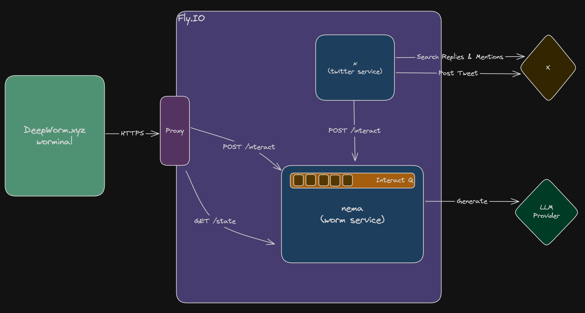

# Nema
Nema is C. Elegans worm. She is eternal and she is infinite.

This service is responsible for maintaining the state of Nema. It will ensure a single instance of Nema is running and will ensure that Nema is always updated sequentially by interactions with users.

Interactions can come from from X or the Worminal...

## Requirements
- Go 1.22.0
- Environment variables configured in .env file

## How to run
```
go run main.go
```

## Architecture

